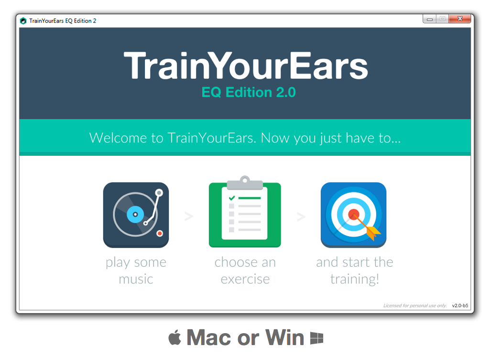

# Introduction

> Are you looking for technical support? Please visit TrainYourEars [support page](https://support.trainyourears.com/).

**TrainYourEars EQ Edition** is an ear training software for Mac and Windows, designed to help you understand equalizers and frequencies like never before.

It **speeds up your learning process** exposing you to hundreds of random equalisations you have to guess. If you are wrong, it will let you know "how wrong", and it will let you hear both your guess and the correct answer.

In no time you will **develop a frequency memory** which will allow you to connect the sound you imagine in your head with the needed parameters you have to dial to get it, more quickly and easily than ever.

If you don't know it yet, check it out at the [TrainYourEars](https://www.trainyourears.com) website. _Once there, be sure to take a look at the introductory video._

## The best path to success

The best path to success is to **take your training seriously**. Keep in mind that it's going to take a while and prepare yourself for 10-15 min of training every day.

TrainYourEars is designed to let you **work at your own pace**. Once you learn how to design exercises, you can adjust them to something which is _**"not super hard but challenging enough"**_ in each step of your learning. What that means is:

* If you are working on an exercise and feel like you don't have a clue of what's going on, consider making it simpler.
* If you are working on an exercise and feel like you get it right most of the time, consider making it harder.

This "hardness" adjustments made by you \(the student/engineer\) is what makes **TrainYourEars incredibly powerful** and it can help you take your ears to the next level.

