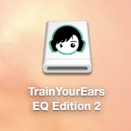
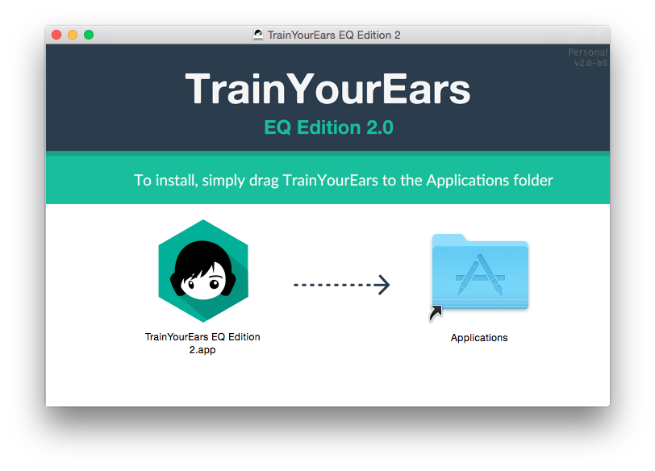
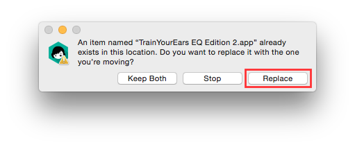
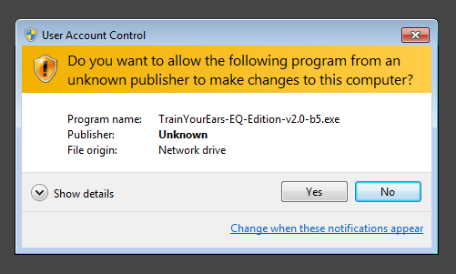
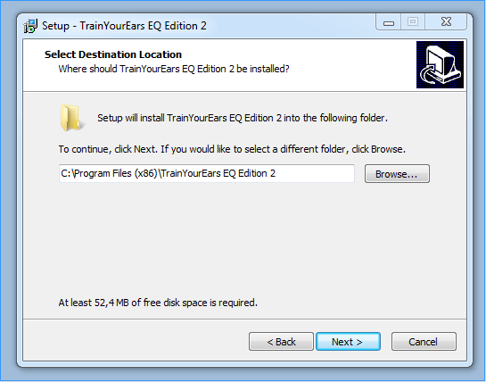

# Installation

This document will show you how to get up and running with [TrainYourEars](https://www.trainyourears.com).

## Mac \(OSX\)

To install **TrainYourEars EQ Edition**  on a Mac, follow this steps:

1. Once you have downloaded the `.dmg` file from your email double click on it.
2. Accept the terms and conditions.
3. You will see a new volume in your desktop which looks like this:

1. If it's not already open, double click on it.
2. You will see an image like this:

1. Now just drag **TrainYourEars** and drop it on the _Applications_ folder you see.
2. That will copy the `TrainYourEars EQ Edition 2.app` in your _Applications_ folder so you can find it  afterwards.
3. If you have already installed a previous version of _TrainYourEars_ it will ask for replacement. Click on `Replace`.

## PC \(Windows\)

To install **TrainYourEars EQ Edition**  on a PC, follow this steps:

1. Once you have downloaded the `.zip` file from your email double click on it and extract its contents.
2. Then, double click on the `.exe` file.
3. If Windows ask you for admin permissions, click on `Yes`.

1. Accept the terms and conditions.
2. Choose the folder where you want to install TrainYourEars.

1. Finally, click on `Install`.

