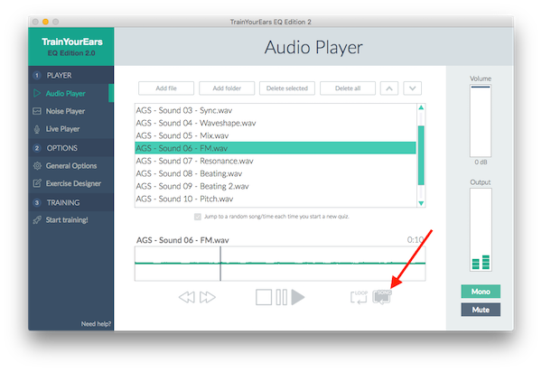

# Quick Sound Modulations by Andrei Georgescu

Andrei is a 23-year-old **certified Bitwig Studio Professional** who began producing music at the age of 17. Currently, he makes music under the artist name of **Liviu**. He plans to get a degree in Computer Science on top of his two current music degrees with the eventual goal of creating VSTs and working in the gaming industry.

## Download the package

[**Click here to download the Quick Sound Modulations package.**](https://cdn.trainyourears.com/exercises/andrei-georgescu/Quick%20Sound%20Modulations%20Package%20by%20Andrei%20Georgescu.zip)

The .zip file contains two folders: one with exercises and the other one with sound files.

Unzip it and use the **Import folder** button to load the exercises in TrainYourEars. Don't forget to add the sound files to the audio player too.

## Andrei Georgescu’s introduction

> **This package is intended for intermediate and advanced users.**
>
> This package continues off from my last one, [Slow Sound Modulations](slow-sound-modulations.md). It is under the same vein of training your ears using non-static modulations in order to train them more for complex real world application than a purely static modulation could do.
>
> The last package used heavy and obvious modulations. This one, however, does not go that route, but instead focuses on very subtle modulations over long periods of time. Morphing ambient pads and strangely repeating plucks are the sounds I've chosen for this purpose.
>
> In some ways this may be much easier or much more difficult depending on many factors, including how fast the user is at identifying the equalization. The reason for this is because if the user cannot identify in a short period of time what equalization is being used, the sound will have already changed, but so subtly that in many ways it could throw off the user's estimation and confuse them all together.
>
> In this sense, I consider this a "time attack mode". It becomes very easy when you identify the equalization almost immediately but very difficult when you can't, thus it forces the user to make quick split second decisions and learn to trust their gut because many a time, second guessing yourself when it comes to ear training, is not a good thing.
>
> Another important difference to the last package is that the equalizations are more complex and difficult because the modulations are no longer as drastic in comparison. The difficulty is no direct order, you choose your own based off of the combination of sound and equalization exercise.

Please note that in order to properly use this package you have to enable the "Loop Song" feature in the Audio Player screen:

## List of Sounds

### 1. 5 Bands

5 bands spread out through the frequency range with high db boosts and cuts; wide and sharp widths.

### 2. High & Low Shelves

High and low shelves with medium gain and sharp widths.

### 3. Bandpass

Low and high cut filters with fairly high gain and medium width creating a bandpass.

### 4. 2 Band Octaves

Two bands of differing gain and width will be chosen from 8 octaves.

### 5. Low & High Cut + Band

Low and high cut with a medium gain band.

### 6. Cut vs. Shelf

Low and high filters or shelves chosen, centered around 250Hz.

### 7. Width Sizes

Comparison of different band width sizes in octaves.

### 8. Low & High Shelf + Band

Low and high shelves with a medium gain band.

### 9. Bandpass 2

Bandpass using a regular bandpass filter in octaves and with different widths.

### 10. Everything

Everything.

## Questions and Feedback

If you have any questions or feedback about this package you can contact us on [info@trainyourears.com](mailto:info@trainyourears.com). We'll be happy to help!

Have you created some interesting exercises and want to share them with the world? That's awesome! Just send us an email \(to the email address above\) and we'll publish them here :\)

