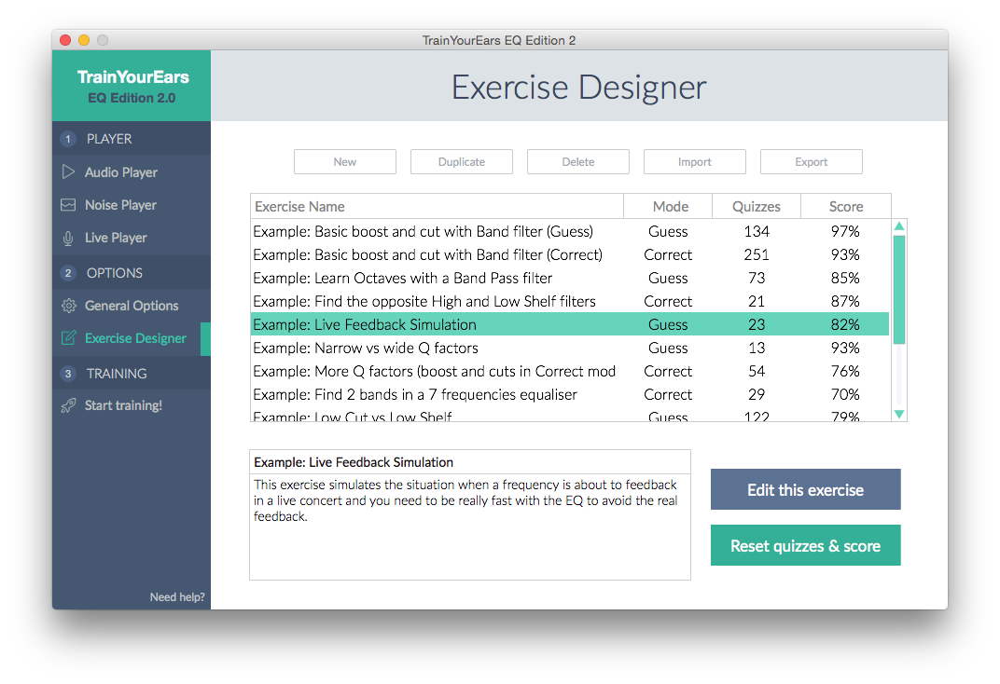
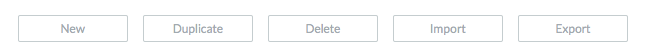
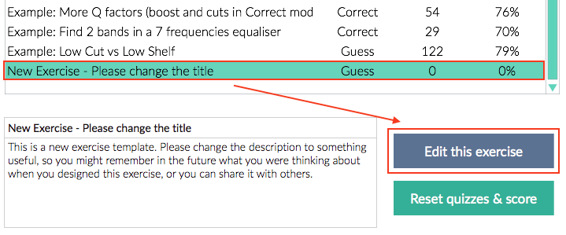
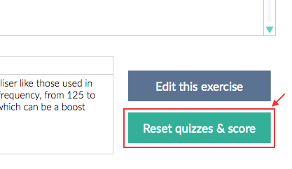

# Exercise Designer

In this screen you can choose the exercise you want to use and create new ones.

## Exercise List Buttons

### New

Create a new exercise at the end of the list. Once you have created it, select it and click on the `Edit exercise` button to change its name and parameters.

### Duplicate

Same than `New` but creates a duplicate instead of a new one. Click on `Edit exercise` to change it.

### Delete

Delete the selected exercise. Be aware, this cannot be undone.

### Import

Select an exercise file \(in `json` format\) in your hard drive and load it into TrainYourEars.

### Export

Save the selected exercise to your hard drive so you can recover it later or send it to your friends. The exercise is saved in `json` format.

## Edit exercise

Click here to go to the :doc:`exercise-editor` screen to edit the selected exercise.

## Reset quizzes & score

Click here to reset both quizzes and score to `0` for the selected exercise.


If you want to improve the score of your exercise you can keep doing quizzes, you don't have to reset it if you don't want to. Remember that the score is calculated with the last X quizzes. X is selected on [General Options](general.md).


