# Exercise Editor

In this screen you can edit the selected exercise and adjust its parameters.

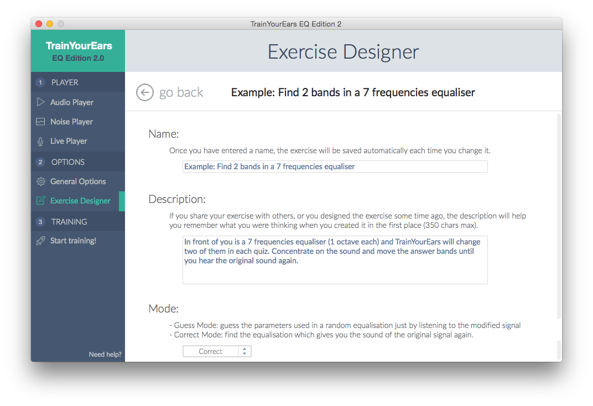

Changes in this screen will be saved automatically.

## Name

Change the name of the exercise.

> **blue** If you are editing a new exercise, please give it a proper name first.

## Description

Change the description of the exercise.

If you share your exercise with others, or you designed the exercise some time ago, the description will help you remember what you were thinking when you created it in the first place.

## Mode

**TrainYourEars 2** has two different modes, `Guess` and `Correct`.

### Guess

This mode is the same that was available on _TrainYourEars 1_.

You have to **guess** the parameters used in the random equalisation just by listening to the modified signal.

It has these 4 steps:

1. You hear the original signal.
2. Your hear it again, but this time with a random equalisation applied.
3. **You guess which parameters were used, and you enter them in the software.**
4. You finally see if you were right or wrong.

> **blue** This method has been used for over 40 years by many teachers. In the past, there were exercises saved on CD's or even tapes, where you had to write down the answers. Now with TrainYourEars you don't have those limits anymore.

### Correct

This mode is new in TrainYourEars 2.

In this mode you have to find the opposite of the random equalisation to get the sound of the original signal again, but this time you can listen while you guess. The tricky part is that you cannot go back and listen again to the original signal.

It has these 4 steps:

1. You hear the original signal.
2. You here it again, but this time with a random equalisation.
3. **You use the EQ to correct the signal and make it sound like the original again.**
4. You finally see if you were right or wrong.

Making the signal sound like the original again means you have to find the opposite EQ, so the result is flat again.

> **blue** The person who suggested this method to us in the first place was [Bob Katz](https://en.wikipedia.org/wiki/Bob_Katz), a renowned mastering guru. We tested it, we loved it, so here it is for all you to enjoy!

## Audio Options

Here you can configure the things which happen after, before and in between of the `Original` and the `Equalised` signals.

### Original Audio

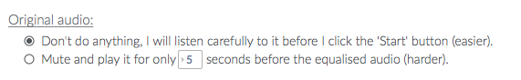

There are two options:

* If you choose the first one, you will have to listen to the `Original` signal before clicking on the `Start Quizz` button.
* If you choose the second one, the audio will be `Muted` until you click on the `Start Quizz` button. Once you have clicked, you will hear it only for the time selected in the box. This makes the exercise more challenging.

### Audio between Original and Equalised

This is the audio you hear between the `Original` and the `Equalised` signal.

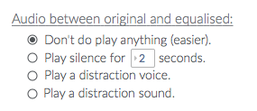

When you hear both signals \(`Original` and `Equalised`\) one right after the other it is easier to pinpoint the difference.

If you want to make the exercise more challenging, you can use a silence, a distraction voice or a sound between both signals.

There are four options:

* **Don't do anything**: It will play the `Equalised` signal right after the `Original` signal.
* **Play silence for** `X` **seconds**: It will mute the signal during the time selected.
* **Play a distraction voice**: It will play a voice after the `Original` signal.
* **Play a distraction sound**: It will play a sound after the `Original` signal. This sound does a sweep of all frequencies.

### Equalised Audio

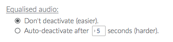

There are two options:

* **Don't deactivate**: Hear the equalised signal as much as you want.
* **Auto-deactivate after** `X` **seconds**: Hear the equalised signal only for the time selected.

> **blue** This option is only used in `Guess` mode. In `Correct` mode, you will hear the `Equalised` signal always while equalising to get the sound of the `Original` signal again.

### Audio between Equalised and Original

This is similar to **Audio between Original and Equalised** but used after hearing the `Equalised` signal.

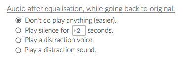

Like the other ones, use this option to make the exercise more challenging.

## Band Parameters

This is one of the most important screens because it lets you configure the exercise.

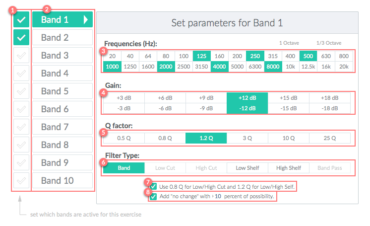

It has 8 different parts. Let's see what they do.

### 1. Active Bands

Toggle active bands for the current exercise.

Most beginner exercises only have one band. But when you improve your skills, training with more than one band at the same time will be very useful. Note that many real sound engineering tasks involve more than once frequency balance issue at the same time, so get prepared for it!

### 2. Selected Band

Click in the different bands to edit them.

### 3. Frequencies

The frequencies you choose here will be used to generate the random equalisation.

If you click on `1 Octave` or `1/3 Octave` it will override your settings with those common values.

### 4. Gains

The gains you choose here will be used to generate the random equalisation.

If you want to train only boosts, unselect all the negative values and if you want to train only cuts, unselect all the positive values.

> **blue** `Low Cut`, `High Cut` and `Band Pass` filters do not have a gain value, so this won't have effect if the random equalisation ends up selecting one of those filters.

### 5. Q factors

The Q factors you choose here will be used to generate the random equalisation.

Q factor controls the bandwidth—or number of frequencies—that will be cut or boosted by the equaliser.

* The lower the Q factor, the wider the bandwidth \(and the more frequencies will be affected\).
* The higher the Q factor, the narrower the bandwidth \(and the fewer frequencies will be affected\).

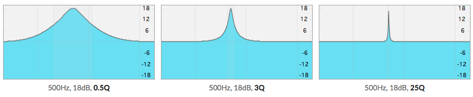

### 6. Filter Types

The filter types you choose here will be used to generate the random equalisation.

There are 6 different filter types:

* **Band**: it makes a boost \(peak\) or a cut \(dip\) in the frequency response. It is the most common filter and it is also known as _peak_ filter.

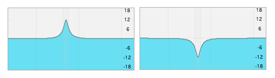

* **Low Cut**: it doesn't modify the part of the signal with a frequency higher than its _cut frequency_ but it removes the part of the signal with frequency lower than its _cut frequency_. It is used to cut unwanted low-frequency signals and it is also known as _high-pass_ filter.

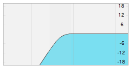

* **High Cut**: it doesn't modify the part of the signal with a frequency lower than its _cut frequency_ but it removes the part of the signal with frequency higher than its _cut frequency_. It is used to cut unwanted high-frequency signals and it is also known as _low-pass_ filter.

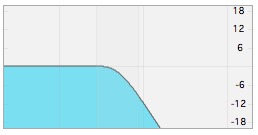

* **Low Shelf**: it doesn't modify frequencies above its _shelf frequency_ but it increases or reduces frequencies below its _shelf frequency_. It is used to correct low frequency signal unbalances.

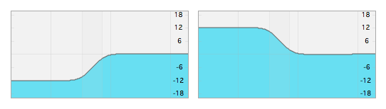

* **High Shelf**: it doesn't modify frequencies below its _shelf frequency_ but it increases or reduces frequencies above its _shelf frequency_. It is used to correct high frequency signal unbalances.

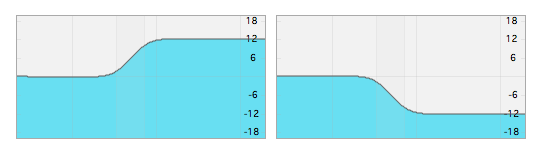

* **Band Pass**: it passes frequencies within a certain range and rejects \(attenuates\) frequencies outside that range. It is not used in audio applications, but can be useful to train.

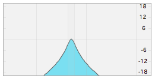

### 7. Low/High Cut and Shelf Q factors

Sometimes you want to train at the same time with `Band` and `Low/High Cut` or `Low/High Shelf` filters, but you don't want to train Q factors.

This option freezes the Q of those `Low/High` filters to 0.8 and 1.2Q, which is the standard. The `Band` filter will have the Qs you choose in the `Q factors` section.

Remove this option only when you want to specifically train the Q factors of `Low/High Cuts` and `Low/High Shelf` filters.

### 8. Add "no change"

If you check this option, the random equalisation generator can assign "no change" to this band and the original signal won't be affected.

> **blue** If you are training with more than one band, the other bands can still modify the original signal.

