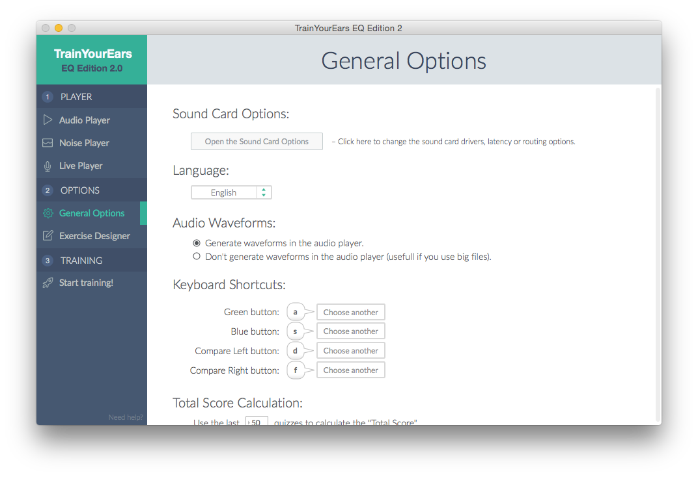
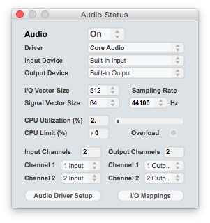
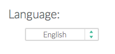
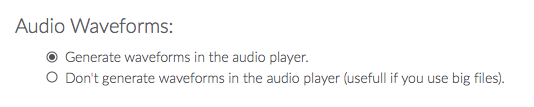
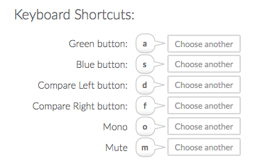
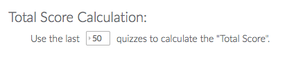
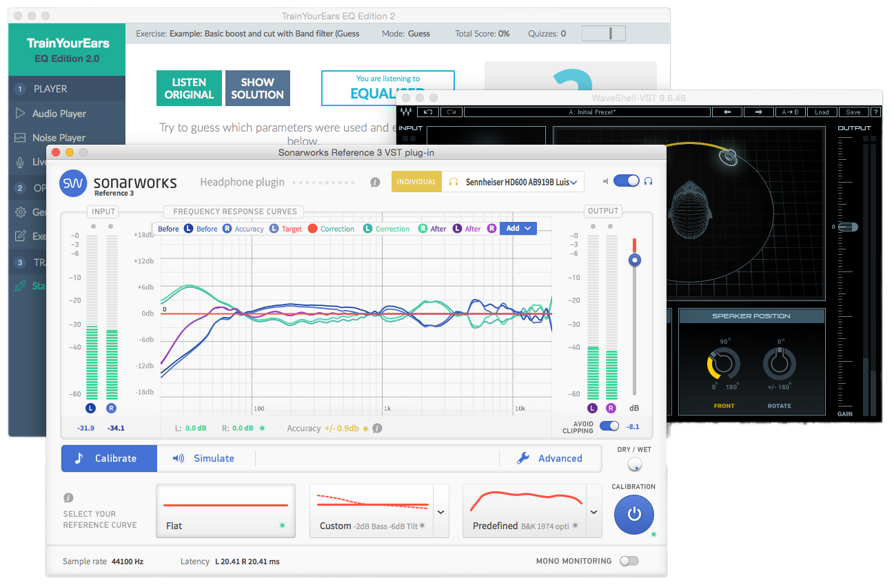
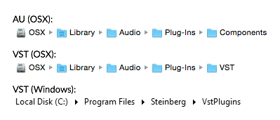

# General Options

In this screen you can configure the general options of TrainYourEars. Keep scrolling for a detailed explanation of each option.

## SoundCard Options

Here you can choose between your audio interfaces, drivers and other stuff like latency or input/output channels.

### Audio Driver

The first thing you need to choose is the audio driver.

In OSX, `Core Audio` is recommended.

In Windows, it depends on the audio interface you are using. If it is a built-in sound card which doesn't support ASIO, you can use either `Direct Sound`or `MME`. If you are using an ASIO-compatible sound card then choose ASIO because the latency will be way much smaller.

When you have selected the audio driver you want to use, various input \(Input Channels, Input Device, and Input Source\) and output \(Output Channels, Output Device\) settings will become available based on the audio driver you choose.

### Input Device

If you are using the [Live Player](../player/live.md) you will have to select the input device here.

Click on the Input Device pop-up menu and choose the source you want to use from the menu.

### Output Device

Click on the Output Device pop-up menu and choose the destination you want to use from the menu.

### I/O and Signal Vector Sizes

Use them to adjust the latency of your soundcard. If you hear clicks or pops, increase their values.

### Monitoring CPU usage

_CPU Utilization_ displays a rough estimate of how much of your computer's CPU is being allocated for crunching audio in TrainYourEars. You can limit it if you want, but it is not recommended.

### Input and Output Channels

If you want to monitor the signal for other outputs different than 1-2, then choose them here.

If you are using the [Live Player](../player/live.md) with an external input, you can choose the input channels here as well.

## Language

Choose the language of TrainYourEars

English, Spanish, German, French, Russian, Italian and Dutch are available, but we will keep adding more.

If you want to help us with the translation of any other language not currently available in TrainYourEars, or the translation of these docs to your language, send us an email to info@trainyourears.com.

## Audio Waveforms

You can turn off the generation of audio waveforms. This can be useful in old computers with only one core, or if you use very big files.

## Keyboard Shortcuts

You can assign different shortcuts for the common buttons of the Training process. To assign a new shortcut, just press on `Choose another` and then on the key you want to use.

_Please note that only letters and numbers are allowed._


You can control the Audio Player play/pause using the spacebar.


## Total Score Calculation

You can change the number of quizzes used to calculate the `Total score` value of each exercise. It is useful so you don't have to reset the score and quizzes of your exercises, you can keep doing them and the `Total Score` will reflect your improvements in a more accurate way.

Reduce it if you want to give more importance to your last results. Increase it if you want to know how well you are doing from a longer time.

Changes will affect only after a restart of TrainYourEars.

## VST/AU Plugins

You can use up to 3 monitoring plugins inside TrainYourEars, like for example [_Sonarworks Reference 3_](http://bit.ly/2wlCnd6) or [_Waves NX_](http://www.waves.com/plugins/nx).


**SAVE 10%** on Sonarworks' [**studio headphones** and **speaker calibration**](http://bit.ly/2wlCnd6) products.

To enjoy this exclusive discount simply enter the coupon code **TYE10-X2C** at checkout.

**→ Check out** [**Sonarworks' Products**](http://bit.ly/2wlCnd6) **Now!**


To load a VST/AU plugin, click on `Load Plugin and go to the plugins folder:`

* In **OSX** the AU plugins folder is on `/Library/Audio/Plugins/Components` and the VST plugins folder is on `/Library/Audio/Plugins/VST`. You can use either 32 or 64bit plugins.
* In **Windows** the VST plugins folder is usually on `C:\Program Files\Steinberg\VstPlugins`. Right now TrainYourEars only supports 32bit plugins.

### Waves plugins

Waves plugins don't work like the rest of the plugins. Instead of individual files, they use a common file called _WaveShell_.

If you want to use a Waves plugin \(like [Waves NX](http://www.waves.com/plugins/nx)\), you have to load the _WaveShell_ file first. Then, you can choose the plugin you want in the dropdown which will appear on the right.

