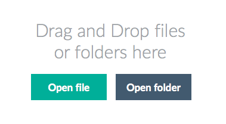
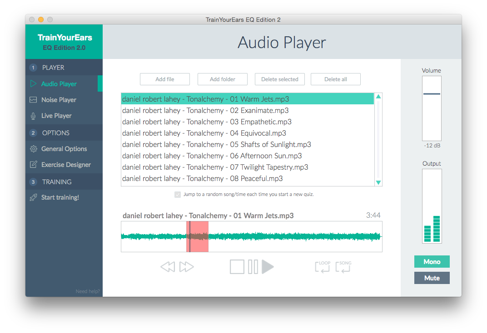
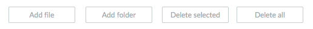
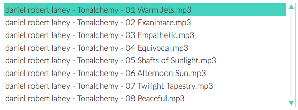
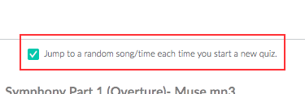
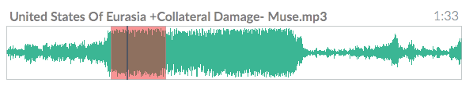
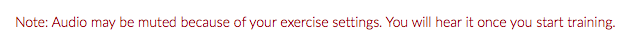

# Audio Player

In the Audio Player you can load and play audio files.

The type of files supported by TrainYourEars are `wav`, `aif`, `mp3`, `ogg` and `m4a`.

If you haven't added any files yet, you will see this screen:

You can drag and drop files, folders or click on the `Open File` or `Open Folder` buttons.

If you choose `Open Folder` or drag a folder it will search in the subfolders as well.

Once you have added some files, you will see the Audio Player:


You can still drag and drop files or folders in this screen and they will be added to the playlist.


The Audio Player has different sections. Let's see what they do:

## Playlist Buttons

### Add File

Add a file to the playlist.

### Add Folder

Add a folder to the playlist. It will search in the subfolders as well.

### Delete Selected

Remove the selected audio file from the playlist.

### Delete All

Clear the playlist and go back to the Drag and Drop screen.

## Playlist

Use it to select the song you want to play.

## Random Player option

TrainYourEars can jump to a random song each time you start a new quiz. This is interesting because each quiz will be totally different from the previous one.

It is recommended when you want to make the current exercise more challenging.

## Waveform

Click to jump to different parts of the song or create loops \(explained in the **audio loop** section.\)

## Audio Player Controls

You can go the previous song, the next song, stop, pause and play.

There are two additional buttons. The first one let's you loop over a defined section \(Audio Loop\) and the second one over the whole song \(Song Loop\).


You can also control Play/Pause using the spacebar.


### Audio Loop

If you click and drag on the waveform you will create a loop, marked in red \(as seen in the waveform image\). If you select the button labeled as `Loop`, the audio will be looped over that section.


If you have activated the Random Player option, the loop will be lost once you start a new quiz and TrainYourEars jumps to another song and time.


### Song Loop

If you click on the button labeled as `Song` the whole song will be played again once it has finished.

## Note: Audio may be muted

Sometimes you can see an advice like this:

This happens when your current exercise has the option `Mute and play it only for X seconds`. Don't worry if you don't hear anything, the audio will start when you start the quiz.

