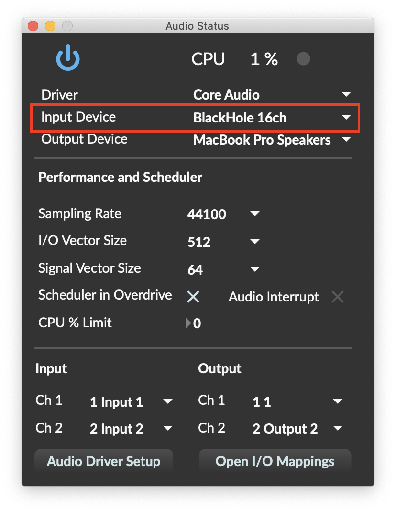
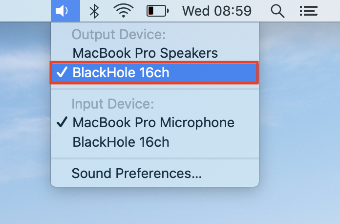
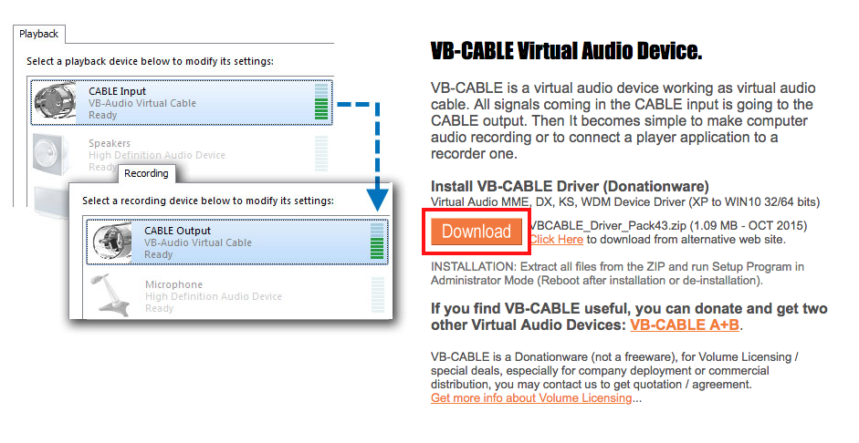

# Live Player

In the Live Player you can route whatever you want, like an external source \(iPod, radio, instrument, other computer\) or an internal source \(iTunes, Spotify, SoundCloud\).

## External Source

1. Connect the signal you want to use to the inputs of your audio interface.
2. Click on the `Open SoundCard Options` button and choose your audio interface as `Input Device`.

1. Finally, choose the input channels you are using to route the signal.

## Internal Source

In order to route audio from other programs running inside your computer, you need an internal router. We use `BlackHole` in OSX and `VB-CABLE` in Windows. Both are free and work really well.

### OSX Internal Routing with BlackHole

First, install BlackHole.

1. [Download BlackHole](https://cdn.trainyourears.com/assets/BlackHole.v0.2.6.pkg) to your computer.
2. Open the `dmg` file.
3. Launch `BlackHole.v0.2.6.pkg` to install it.
4. Agree to the License terms and install it.
5. Restart your computer.

Now, open **TrainYourEars** and route the signal.

1. Choose `BlackHole (16ch)` as input in **TrainYourEars**.

1. Alt+click on the volume icon of the menu bar.

1. Choose `BlackHole (16ch)` as output in your system.
2. Now any signal played in your computer should be routed to **TrainYourEars**.

Once you have finished your training, remember to select your normal output again.


If you hear noises try switching to `ad_portaudio Core Audio` driver instead. In certain computers it works better than `Core Audio`.


### Windows Internal Routing with VB CABLE

First, install VB-CABLE.

1. [Download VB-Cable](http://www.vb-audio.com/Cable/index.htm) to your computer. Scroll down until you see the orange DOWNLOAD button:

1. Unzip the `zip` file.
2. Right click on `VBCABLE_Setup_x64.exe` and choose `Run as Administrator`.


If your system has only 32bits, run **VBCABLE\_Setup.exe** instead.


1. Click on `Install Driver`.
2. Restart your system.

Now, open **TrainYourEars** and route the signal.

1. Choose `CABLE Output (VB-Audio Virtual Cable)` as input in **TrainYourEars**.

1. Right click on the volume icon and choose `Playback Devices`

1. Click on `Cable Input` and then on `Set Default`.

1. Now any signal played in your computer should be routed to **TrainYourEars**.

Once you have finished your training, remember to select your normal output again.

