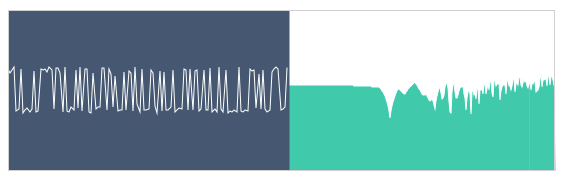

# Noise Player

In the Noise Player you can select `Pink Noise` or `White Noise`.

Noise is usually recommend for training, but only in the beginning.

## Pink Noise

It is defined by: "Each octave carries an equal amount of energy."

The frequency balance is perceived as "flat" for the human hear. It can be good to use it for a while when you have never trained with this method before and need to figure out how it works.

Once you get the concept of this training, it's best to move to the music you are interested in.

## White Noise

It is defined by: "Each frequency carries an equal amount of energy."

To the human ear, it appears to have more energy in the high frequencies.

It is less recommended for training but it can be useful when you want to keep training with noise during more time and you have already learn how the `Pink Noise` sounds exactly.

