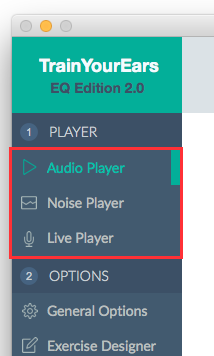
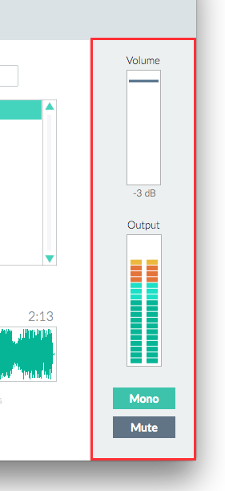

# The Player Section

Selecting some audio from the Player section should be your first step each time you want to train.

One of the many advantages of TrainYourEars is that it lets you choose the audio you want to train with. You have three options.

## Three different options

Each screen lets you select different audio signals.

### Audio Player

Play your own files. You can use songs or even tracks. It depends on what you are trying to learn.


For example, if you want to learn how different `Low Cut`filters affect a guitar you've just recorded, just load that track and set up an exercise with different `Low Cuts.`


Check the [Audio Player](audio.md) section for more info.

### Noise Player

Use a noise generator with pink or white noise. This is recommended only for the first steps of the beginners.

Check the [Noise Player](noise.md) for more info.

### Live Player

One of the most requested features of TrainYourEars: **choose any external source**.

This Live Player allows you to route software playing in your computer, like iTunes, Spotify or even websites \(Youtube, SoundCloud\) straight to TrainYourEars, so you can train with that signal.

Check the [Live Player](live.md) for more info.

## Volume and other controls

You can control the volume of the audio input in any of those screens, using the fader on the right.

There are controls for `Mute` and `Mono` as well, and an output VU meter to evaluate the volume of the incoming signal.


You have to be careful when setting up your volume. Remember that TrainYourEars applies a random equalization to the signal. If it applies a boost, it will raise the volume several dBs and it could clip the output.


