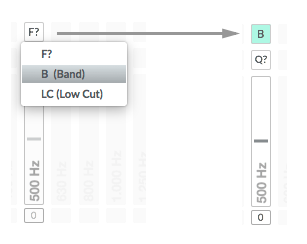
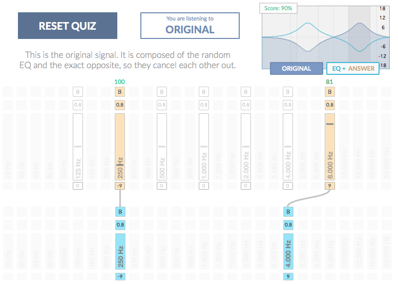

# Training in Correct Mode

TrainYourEars has a new training method called `Correct`.

In `Correct` mode you have to find the exact opposite EQ of the random equalisation so they cancel each other out. This time, you can listen to what you are doing, so it's not a blind test like the `Guess` mode. The trick here is that you can't go back to hear the original signal once the quiz has started.

Each quiz has these 4 steps:

1. You hear the original signal.
2. You hear it again, but this time with a random equalisation applied.
3. You use the EQ to **correct** the signal and make it sound like the original again.
4. You finally see if you were right or wrong.


The person who suggested this method to us in the first place was [Bob Katz](https://en.wikipedia.org/wiki/Bob_Katz), a renowned mastering guru. We tested it, we loved it, so here it is for all you to enjoy!


## 1. Listen to the original signal

This the first screen you will see before starting the quiz:

All you have to do is listen carefully to the `Original` signal. Once you think you are ready, press the `START QUIZ` button to hear the `Equalised` signal.

If your current exercise has the `Muted` option activated, you won't hear anything and you will see this screen instead:

Don't worry, just press the `START QUIZ` button and you will be able to hear the `Original` signal for the number of seconds you have selected in the :doc:`exercise-editor` option.


If you have selected `Silence`, `Distraction voice` or `Distraction noise` between the **Original** and the **Equalised** signals, you will hear it before the next step.


## 2. Listen to the equalised signal

Now you are listening to the equalised signal. The program has applied a random equalisation based on the ranges you have selected in the :doc:`exercise-editor`.

For example, if you selected two gains, `+12dB` and `-12dB` there is a 50% of chance that TrainYourEars will choose `+12dB` and a 50% of chance that TrainYourEars will choose `-12dB`.

## 3. Make it sound like the original again

As you can see some `Answer Bands` have appeared on the screen. You will have to use them to select your answer.

In `Correct` mode you have to use those `Answer Bands` to modify the signal and make it sound like the original again. That means you will hear the changes and can keep modifying the signal until you are confident you are hearing a flat \(no equalised\) signal.

Unlike the `Guess` mode, you can't go back to hear the `Orginial` signal. You have to remember how it sounds and try to match that sound. This is the mental effort of this method.

### Answer Bands

They have three fields, Filter type, Q factor and Gain.

1. **Filter type**:
   * If you have selected more than one `Filter type` or your exercise has more than one band with different `Filter types`, you can select here the type of filter you think the answer is.
   * If there is only one `Filter type` available, it will just appear in green.

1. **Q Factor**:
   * If you have selected more than one `Q factor` or your exercise has more than one band with different `Q factors`, you can select here the type of Q factor you think the answer is.
   * If there is only one `Q factor` available, it will just appear in green.

1. **Gain**:
   * Select the gain you think the answer is.


If your exercise has only one dB choice above and/or below 0dB, you may just click above or below. If there are more than one positive or negative dB choices,  you’ll need to slide it to select your dB answer.


### Valid Answers

When you have selected those three fields correctly, the band becomes a `Valid Answer` and a green checkmark appears above it. At that moment, you will hear its effect on the signal.

It looks like this:

There are two really **important things** to note here:

1. **A** `Valid Answer` **doesn't mean you are right, it only means TrainYourEars will validate it once you click on the** `SHOW SOLUTION` **button.**
2. **You won't hear any change in the sound until an answer is a** `Valid Answer`. **That means that even if you choose a** `Gain` **you won't hear it until you choose a** `Filter type` **and** `Q factor` **and the green checkmark appears.**

### Graphic Equaliser

In `Correct` mode you can see the EQ applied by you with the `Answer Bands` in the graphic equaliser.

When there isn't any `Valid Answer` you will be hearing only the signal with the random equalisation \(blue question mark\):

When you select a `Valid Answer`, you will hear that EQ applied to the signal.

You will be listening to both the random equalisation \(blue\) and your guess \(orange\) at the same time.

Once you have selected all the answers and you think the signal sounds like the `Original` again, it's time to see if you were right or wrong.

## 4. Check if you were right or wrong

Click on the `SHOW SOLUTION` button.

You will see a screen like this:

Let's analyze the things that changed.

### Answers and Solution Bands

`Answers` have turned orange and `Solutions` have appeared below in blue.

A cable connects each `Solution` with the closest `Answer` and above the answer the `Score` of that match, from 0 to 100.

If the random equalisation selected was `No-Change` you will see this symbol in the Solutions section:

Or in red if you didn't answer correctly:

### Equaliser Section

In the equaliser section you can compare the three signals:

1. **ORIGINAL**:

Click on the blue `ORIGINAL` button.

Although you are listening to the `Original` signal, which is flat and doesn't have any EQ applied, you will see two things in the graphic equaliser:

1. The light blue curve is the random equalisation.
2. The dark blue curve is the solution: the exact opposite of the random equalisation.

When both curves are mixed together, the result is a flat signal.

1. **EQ + ANSWER**:

Click on the `EQ + ANSWER` button.

If you compare both equalisers one after the other, you can see how far where you from the correct solution:

If you failed, compare the signals until you think you got the difference between them. Don't worry too much if it seems difficult at first, you will learn it by repetition.

1. **EQUALISED**:

Click again on the `ORIGINAL` or the `EQ + ANSWER` button and you will hear the `EQUALISED` signal.

### Score

The average score for all the bands of the current exercise appears in the left corner of the equaliser:

This is different from the `Total Score` which appears in the title bar, which means the average score of all the quizzes you have done so far.

Once you are ready to start a new quiz, click on `RESET QUIZ` button.

