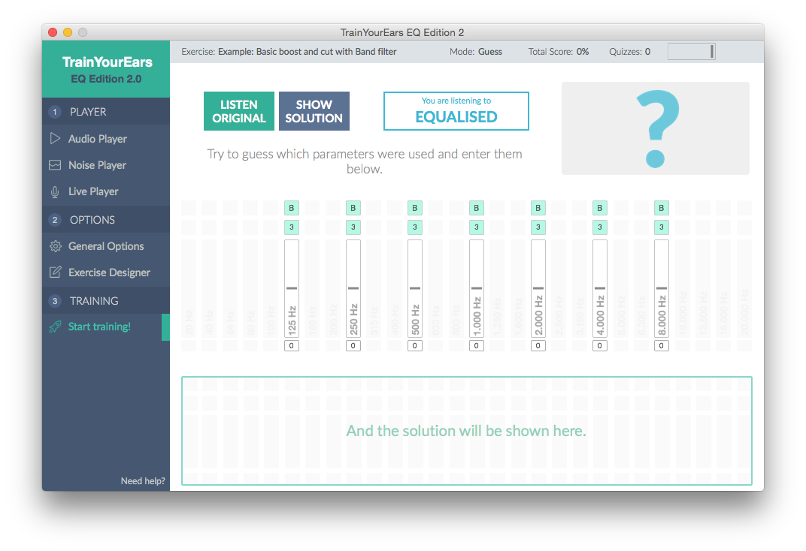

# Training in Guess Mode

Time to start the training!

First, we will explain how to train with a `Guess` exercise. This was the only mode available on TrainYourEars 1.

Remember, in `Guess` mode you have to **guess** the parameters used in the random equalisation just by listening to the modified signal.

Each quiz has these 4 steps:

1. You hear the original signal.
2. You hear it again, but this time with a random equalisation applied.
3. You **guess** which parameters were used, and you enter them in the software.
4. You finally see if you were right or wrong.


This method has been used for over 40 years by many teachers. In the past, there were exercises saved on CD's or even tapes, where you had to write down the answers. Now, with TrainYourEars, you don't have limitations anymore.


## 1. Listen to the original signal

This the first screen you will see before starting the quiz:

All you have to do is listen carefully to the `Original` signal. Once you think you are ready, press the `START QUIZ` button to hear the `Equalised` signal.

If your current exercise has the `Muted` option activated, you won't hear anything and you will see this screen instead:

Don't worry, just press the `START QUIZ` button and you will be able to hear the `Original` signal for the number of seconds you have selected in the :doc:`exercise-editor` option.


If you have selected `Silence`, `Distraction voice` or `Distraction noise` between the **Original** and the **Equalised** signals, you will hear it before the next step.


## 2. Listen to the equalised signal

Now you are listening to the equalised signal. The program has applied a random equalisation based on the ranges you have selected in the :doc:`exercise-editor`.

For example, if you selected two gains, `+12dB` and `-12dB` there is a 50% of chance that TrainYourEars will choose `+12dB` and a 50% of chance that TrainYourEars will choose `-12dB`.

## 3. Guess the parameters used

In `Guess` mode you can go back and forth between the `Original` and the `Equalised` signal so feel free to click on the `Listen Original` button if you are not sure about the answer.


If you have selected `Silence`, `Distraction voice` or `Distraction noise` between the **Equalised** and the **Original** signals, you will hear it when you click on **Listen Original** again.


As you can see some `Answer Bands` have appeared on the screen. You will have to use them to select your answers.

### Answer Bands

They have three fields, Filter type, Q factor and Gain.

1. **Filter type**:
   * If you have selected more than one `Filter type` or your exercise has more than one band with different `Filter types`, you can select here the type of filter you think the answer is.
   * If there is only one `Filter type` available, it will just appear in green.

1. **Q Factor**:
   * If you have selected more than one `Q factor` or your exercise has more than one band with different `Q factors`, you can select here the type of Q factor you think the answer is.
   * If there is only one `Q factor` available, it will just appear in green.

1. **Gain**:
   * Select the gain you think the answer is.


If your exercise has only one dB choice above and/or below 0dB, you may just click above or below. If there are more than one positive or negative dB choices,  you’ll need to slide it to select your dB answer.


### Valid Answers

When you have selected those three fields correctly, the band becomes a `Valid Answer` and a green checkmark appears above it.

It looks like this:

**Be aware: A 'Valid Answer' doesn't mean you are right, it only means TrainYourEars will validate it once you click on the 'SHOW SOLUTION' button.**

Once you have selected all the answers, it's time to see if you were right or wrong.

## 4. Check if you were right or wrong

Click on the `SHOW SOLUTION` button.

You will see a screen like this:

Let's analyze the things that changed.

### Answers and Solution Bands

`Answers` have turned orange and `Solutions` have appeared below in blue.

A cable connects each `Solution` with the closest `Answer` and above the answer the `Score` of that match, from 0 to 100.

If the random equalisation selected was `No-Change` you will see this symbol in the Solutions section:

Or in red if you didn't answer correctly:

### Equaliser Section

In the equaliser section you can compare the three signals:

1. **Equalised**:

Click on the blue `EQUALISED` button.

1. **Your Answer**:

Click on the brown `YOUR ANSWER` button.

1. **Original**:

Click again on the `EQUALISED` or the `YOUR ANSWER` button and you will hear the `Original` signal.

If you failed, compare the signals until you think you got the difference between them. Don't worry too much if it seems difficult at first, you will learn it by repetition.

### Score

The average score for all the bands of the current exercise appears in the left corner of the equaliser:

This is different from the `Total Score` which appears in the title bar, which means the average score of all the quizzes you have done so far.

Once you are ready to start a new quiz, click on `RESET QUIZ` button.

