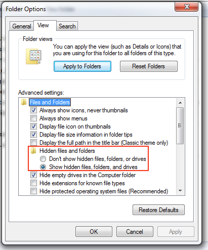
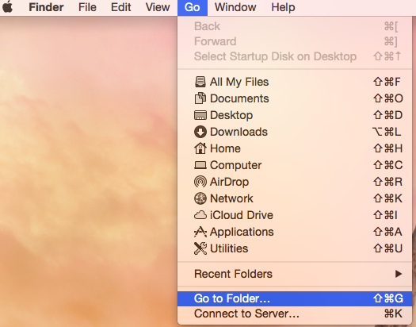
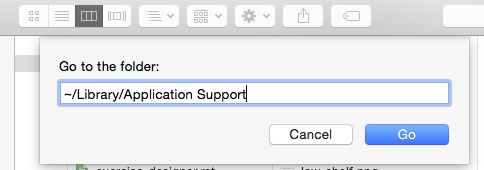

# Reset Preferences

Sometimes things can go wrong and you may want to reset the preferences to see if it helps. Or maybe you want to start again from scratch.


Remember to export any exercise you want to preserve before reseting the preferences.


## PC \(Windows\)

Go to `C:/Users/YOUR-NAME/AppData/Roaming/Cycling'74/` and delete the `TrainYourEars EQ Edition 2` folder.

The folder `AppData` is hidden, but you can see it activating `Hidden Items` in the `View` menu.

Finally, empty the Recycle Bin.

## Mac \(OSX\)

Go to `Delete the folder /Users/your-name/Library/Application Support/` and delete the `TrainYourEars EQ Edition 2` folder.

Library is a hidden folder but you can open it using the Finder option `Go->Go to Folder...` and entering `~/Library/Application Support`.

Finally, empty the Recycle Bin.

